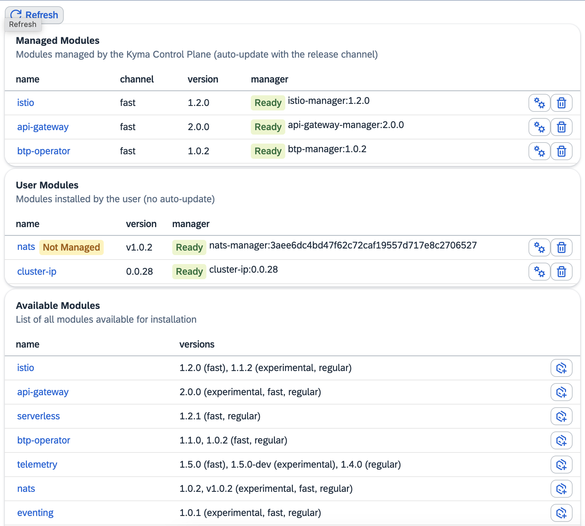

# Kyma community modules

> **This repository contains an early prototype, and is not meant to be used in the production use case. Feel free to try it out, leave feedback, and report issues.**

## Status

[](https://api.reuse.software/info/github.com/kyma-project/community-modules)

## Overview

Install Kyma modules in your Kubernetes cluster. You can select modules from the list and deploy them in your cluster. You can also choose the release channel (experimental, fast, or regular) and the version of the module.

## Prerequisites

- kubernetes cluster (KUBECONFIG configured)
- kyma-system namespace created (some modules installation can fail without it)
- nodejs with npm

## Installation

```
npm install -g kyma
```

Now you can see available kyma modules and their versions:

```
kyma modules
```

You can deploy one or more modules (add option `--dry-run` to see kubectl commands without executing them):

```
kyma deploy -m serverless nats eventing --defaultConfig --dry-run
```

You can provide the module version by adding `:<version>` sufix to the module name. If not provided the version from the provided channel will be used, or the latest version if channel is not specified.

You can also start the web interface locally:

```
kyma ui
```

### Killercoda

If you don't have any cluster at hand you can use this playground:
[https://killercoda.com/interactive-kyma/scenario/oss-modules](https://killercoda.com/interactive-kyma/scenario/oss-modules)

Sample view for managed Kyma Runtime:



## Run (develop) locally

Prepare your development cluster and configure kubectl (KUBECONFIG). Then execute:

```
npm install
npm run build-modules
npm run dev
```

Now open the provided URL, e.g.: `http://localhost:5173`

## Module contribution guideline

The module defines a single Kubernetes custom resource (CR) and a controller that manages it. The controller is responsible for the lifecycle of the module. It creates and deletes the module's resources based on the custom resource state.

### Dependencies

The module is self-contained and should not depend on any other Kyma components directly. The only exception is the dependency to the APIs provided by other modules. Such dependencies should be handled by the controller in the transparent way, by reporting missing APIs and suggesting the installation of the required modules.

### Releases

The module release should be versioned and follow the [semantic versioning](https://semver.org/) rules. Two artifacts are released for each module version:

- kubernetes manifest that deploys the module operator (CRD, RBAC, Deployment, Service, etc.)
- default configuration for the module (custom resource)
The new release should handle the previous version of the module configuration. The module should be able to upgrade the configuration from the previous version to the current one. The upgrade process should be handled by the controller. The module provider should test upgrade scenarios to ensure that no additional manual steps are required to upgrade the module.

### Configuration

The default configuration for the module should be provided as a Kubernetes custom resource and should be applied only once during module installation. Once the configuration is applied it is owned by the user (admin) and should not be modified by the module. The module should not modify the configuration except for the cases when the configuration is migrated to the new version. The module should not delete the configuration. The configuration should be deleted by the user (admin) before the module is uninstalled.

## Adding a new module

Edit the `modules.js` file and add a new entry to the `modules` list. The entry should contain the following fields:

- `name` - the name of the module
- `documentation` - the link to the module documentation
- `repository` - the link to the module repository
- `managedResources` - the list of the Kubernetes resources managed by the module
- `manageable` - the flag that indicates if the module is manageable by the Kyma Lifecycle Manager
- `latestGithubRelease` - the information about the latest GitHub release of the module
- `versions` - the list of the module versions. Each version can override the `latestGithubRelease` information by providing the `deploymentYaml` and `crYaml` fields with urls to the deployment and CR manifests.

Sample entry:

```js
  {
    "name": "btp-operator",
    "documentation": "https://kyma-project.io/#/btp-manager/user/README",
    "repository": "https://github.com/kyma-project/btp-manager.git",
    "managedResources": [
      "/apis/services.cloud.sap.com/v1/serviceinstances",
      "/apis/services.cloud.sap.com/v1/servicebindings",
      "/apis/services.cloud.sap.com/v1alpha1/servicebindings",
      "/apis/services.cloud.sap.com/v1alpha1/serviceinstances",
      "/apis/operator.kyma-project.io/v1alpha1/btpoperators"
    ],
    "manageable": true,
    "latestGithubRelease" : {
      "repository": "kyma-project/btp-manager",
      "deploymentYaml": "btp-manager.yaml",
      "crYaml": "btp-operator-default-cr.yaml"
    },
    "versions": [
      {
        "version": "1.1.2",
        "deploymentYaml": "https://github.com/kyma-project/btp-manager/releases/download/1.1.2/btp-manager.yaml",
        "crYaml": "https://github.com/kyma-project/btp-manager/releases/download/1.1.2/btp-operator-default-cr.yaml",
      }
    ]
  }
```

If you want to test your module, you can have to regenerate modules:

```
npm run build-modules
npm run dev
```

## Contributing

For standard contribution rules see [CONTRIBUTING.md](CONTRIBUTING.md).

## Code of Conduct
<!--- mandatory section - do not change this! --->

See [CODE_OF_CONDUCT.md](CODE_OF_CONDUCT.md).

## Licensing
<!--- mandatory section - do not change this! --->

See the [LICENSE file](./LICENSE).
