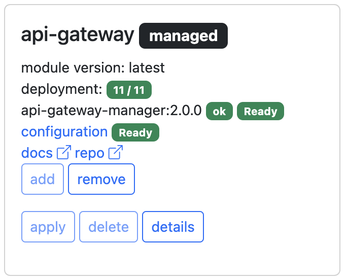

# Kyma community modules

## Overview

Install Kyma modules in your Kubernetes cluster

## Prerequisites

- kubectl
- kubernetes cluster (KUBECONFIG configured)
- kyma-system namespace created (some modules installation can fail without it)

## Installation

Download [kyma.html](https://raw.githubusercontent.com/kyma-project/community-modules/main/app/kyma.html) file and save it in any folder:
```
curl https://kyma-project.github.io/community-modules/kyma.html -o kyma.html
```
Go to that folder and execute kubectl proxy command:
```
kubectl proxy -w='.'
```
Open Web UI with this link: [http://127.0.0.1:8001/static/kyma.html](http://127.0.0.1:8001/static/kyma.html)

If you don't have any cluster at hand you can use this playground:
[https://killercoda.com/interactive-kyma/scenario/oss-modules](https://killercoda.com/interactive-kyma/scenario/oss-modules)

## Usage 

- **add** - adds module to Kyma custom resource (default Kyma CR in kyma-system namespace) and makes it a managed module. It means the module upgrades will be performed automatically when new version is available in the release channel. Available only for manageable modules in the managed Kyma cluster (SKR)
- **apply** - applies the module manager and default configuration directly in your cluster. It means that the module is not managed and the new versions have to be applied manually. When module is managed the option is not available - you need to delete module first (remove it from Kyma CR)
- **delete** - for managed modules it removes entry in the Kyma CR that initiates module deletion from Kyma Control Plane. For manually installed modules the action deletes all manage resources including module configuration, and when all of them are gone, deletes module manager deployment
- **details** - show resources included in the module manager deployment Yaml

## Module view



The module view contains following information:
- module name with optional badges (**managed** for modules managed by Kyma Control Plane, **community** modules that come from the community) 
- module version
- status of module operator (manager) deployment - number of applied resources / total number of resources
- name, version and status of module operator 
- status of module configuration ('applied' - configuration file exists, '-' module configuration does not exist, 'Processing, Ready, Warning, Error, Deleting' - value of the state field of module configuration status). If the configuration CR exists it can be fetched using the link.
- module documentation (docs link)
- source code repository (repo link)

## Contribute your module

Checkout the community-modules repository and add your own module by adding an entry in the [modules.json](app/modules.json) file. Example:
```
  {
    "name": "api-gateway",
    "deploymentYaml": "https://github.com/kyma-project/api-gateway/releases/latest/download/api-gateway-manager.yaml",
    "crYaml": "https://github.com/kyma-project/api-gateway/releases/latest/download/apigateway-default-cr.yaml",
    "documentation": "https://kyma-project.io/#/api-gateway/user/README",
    "repository": "https://github.com/kyma-project/api-gateway.git",
    "managedResources": [
      "/apis/operator.kyma-project.io/v1alpha1/apigateways",
      "/apis/gateway.kyma-project.io/v1beta1/apirules"
    ],
    "versions": [
      {
        "version": "latest",
        "deploymentYaml": "https://github.com/kyma-project/api-gateway/releases/latest/download/api-gateway-manager.yaml",
        "crYaml": "https://github.com/kyma-project/api-gateway/releases/latest/download/apigateway-default-cr.yaml"
      },
      {
        "version": "2.0.0",
        "deploymentYaml": "https://github.com/kyma-project/api-gateway/releases/download/2.0.0/api-gateway-manager.yaml",
        "crYaml": "https://github.com/kyma-project/api-gateway/releases/download/2.0.0/apigateway-default-cr.yaml"
      }
    ]
  },
```
Fields description:
- **name** - name of your module (keep it short)
- **deploymentYaml** - URL of your module deployment YAML (usually the artifact of your module release)
- **crYaml** - URL of your module default configuration (custom resource)
- **documentatio** - documentation URL
- **repository** - main source code repository
- **managedResources** - list of api server resources (paths) that are managed by your module (including the configuration resource)
- **versions** - list of module versions that can be included in release channels. In version entry you can override some module properties (usually deploymentYaml and crYaml)

You should assign module versions to release channels. The channels are defined in the [channels.json](app/channels.json). You define there for each release channel the list of modules and their versions. 
The channels.json and modules.json files are processed by the build workflow that generates release channels files ([latest.json](https://kyma-project.github.io/community-modules/latest.json), [fast.json](https://kyma-project.github.io/community-modules/fast.json), and [regular.json](https://kyma-project.github.io/community-modules/regular.json))
If you want to test your module, you can generate that file on your own:
```
cd script
npm install
cd ../app
node ../script/release-channels.js
```
The latest.json file should be created. To test the UI with this file just add `channel` query parameter pointing to the desired channel: [http://127.0.0.1:8001/static/kyma.html?channel=latest.json](http://127.0.0.1:8001/static/kyma.html?channel=latest.json)

For standard contribution rules see [CONTRIBUTING.md](CONTRIBUTING.md).

## Code of Conduct
<!--- mandatory section - do not change this! --->

See [CODE_OF_CONDUCT.md](CODE_OF_CONDUCT.md).

## Licensing
<!--- mandatory section - do not change this! --->

See the [LICENSE file](./LICENSE).
